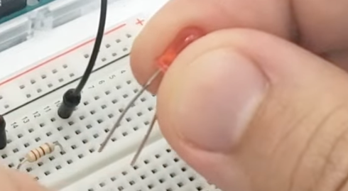

### Inserting diode

Diode should be inserted into the row with resistor with **LONGER** leg

### I used 1K resistors

220 Ω wasn't working but it cracked but haven't damaged diode

### Light code

You have to activate output (e.g. pin 12) via the code, see:

- [1_led_light.ino](1_led_light.ino)

### Result

- [test.mp4](test.mp4)